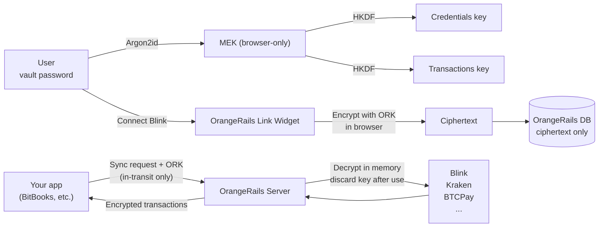

<div align="center">

# OrangeRails

### The rails every Bitcoin business runs on.

**Open-source. Zero-knowledge. Bitcoin-first.**

[](./LICENSE)
[](./.github/workflows/ci.yml)
[](./docs/OrangeRails-Implementation-Plan.md)
[](./docs/OrangeRails-Architecture.md)
[](#self-host-in-under-30-minutes)
[](#)

[**Architecture**](./docs/OrangeRails-Architecture.md) ·
[**Plan**](./docs/OrangeRails-Plan.md) ·
[**Roadmap**](./docs/OrangeRails-Implementation-Plan.md) ·
[**Contributing**](./CONTRIBUTING.md) ·
[**Security**](./SECURITY.md)

</div>

---

## Why this exists

> *"Here we are faced with the problems of loss of privacy, creeping computerization, massive databases, more centralization — and \[David\] Chaum offers a completely different direction to go in, one which puts power into the hands of individuals rather than governments and corporations. The computer can be used as a tool to liberate and protect people, rather than to control them."*
>
> — **Hal Finney**, cypherpunks mailing list, November 1992

Thirty-four years later, every financial data aggregator in existence still operates the way Finney warned against.

**Plaid.** Finicity. Teller. TrueLayer. Yodlee. MX. Mesh Connect. Vezgo. **Every single one** stores user credentials in a form their servers can decrypt. That makes each of them the highest-value target class in consumer fintech — one breach from exposing tens of millions of users' financial histories in plaintext.

In 2022, [LastPass was breached](https://en.wikipedia.org/wiki/LastPass_2022_data_breach). Attackers exfiltrated encrypted vaults and spent the next three years brute-forcing weak master passwords. In March 2025, [federal prosecutors linked a $150 million cryptocurrency heist](https://krebsonsecurity.com/2025/03/feds-link-150m-cyberheist-to-2022-lastpass-hacks/) directly to that breach. Ripple co-founder Chris Larsen was one of the victims.

Plaid itself has never publicly disclosed a breach. As one Hacker News commenter put it in 2021:

> *"Plaid is only one security breach away from being utterly destroyed."* — [HN, August 2021](https://news.ycombinator.com/item?id=28229319)

**OrangeRails is the answer.** Architecturally, not aspirationally.

---

## What makes us different

| | Plaid | Mesh Connect | Teller | TrueLayer | Yodlee | **OrangeRails** |
|---|:-:|:-:|:-:|:-:|:-:|:-:|
| Open source | ✗ | ✗ | ✗ | ✗ | ✗ | **✓** |
| Bitcoin-first | ✗ | ✗ | ✗ | ✗ | ✗ | **✓** |
| Server can read credentials | ✓ | ✓ | ✓ | ✓ | ✓ | **✗** |
| Zero-knowledge | ✗ | ✗ | ✗ | ✗ | ✗ | **✓** |
| Self-hostable | ✗ | ✗ | ✗ | ✗ | ✗ | **✓** |
| Published open spec | ✗ | ✗ | ✗ | ✗ | ✗ | **✓** |

Every other aggregator keeps keys material to decrypt your credentials on their servers. We keep **only ciphertext.** Decryption requires a key derived from your vault password — in your browser — passed in-transit for a single sync request, never persisted.

If an attacker breaches our database, they get encrypted blobs. Without each user's individual vault password, the breach is worthless.

**This is not marketing. It is architecture.** [Read the full technical specification](./docs/OrangeRails-Architecture.md).

---

## How it works



1. **You enter your vault password once.** It never leaves your browser.
2. **Your password derives three keys** via Argon2id + HKDF. Keys live in browser memory only.
3. **When you connect Blink,** the API key is encrypted *in your browser* before being sent to us. We store ciphertext.
4. **When your app syncs,** a derived key rides along in the TLS request body. Our server decrypts in memory, calls Blink, re-encrypts the result, returns it, then zeros the key.
5. **When you log out,** the keys disappear. We cannot sync your account without you.

This is the same architecture used by [Bitwarden](https://bitwarden.com/help/bitwarden-security-white-paper/), [1Password](https://agilebits.github.io/security-design/), [Proton](https://proton.me/security/end-to-end-encryption), and [Signal](https://signal.org/docs/) — applied, for the first time, to a data aggregator.

---

## Who this is for

**Bitcoin businesses and self-sovereign users** who need accounting-grade data integration without surrendering credentials to a closed-source third party.

**Developers building Bitcoin fintech** who would rather plug into an open aggregator than rewrite the Blink/Kraken/BTCPay/xpub adapters from scratch.

**Accountants and CFOs** handling Bitcoin-heavy balance sheets who answer to auditors and regulators demanding demonstrable data-minimization.

**Privacy advocates** who treat *"zero-knowledge"* as an architectural claim that must be verifiable in code, not a bullet point in a marketing PDF.

**Self-hosters** who refuse to hand credentials to any third party, ever. Same code runs on your server.

---

## Status

**Early development.** The OrangeRails API is live at `api.orangerails.com` with a minimal Blink adapter as a proof of concept. The full hub — auth, vault, Link widget, multi-adapter sync engine — is in active build following [the Implementation Plan](./docs/OrangeRails-Implementation-Plan.md).

We are shipping in thin vertical slices. The first deliverable is a single end-to-end user flow: sign up, connect Blink, see your transactions flow into a connected app, end-to-end zero-knowledge.

**Nothing here is production-ready yet.** Star the repo to signal demand. [Watch the repo](https://github.com/MorningRevolution/orangerails) to follow the build.

---

## Join the fight

**This is a cypherpunk project.** Its success depends on community scrutiny, not corporate marketing.

- ⭐ **Star this repo** — visible signal to the Bitcoin ecosystem that this matters.
- 🛠️ **[Contribute](./CONTRIBUTING.md)** — code, adapter implementations, documentation, code review.
- 🔍 **[Audit our credential-handling code](./docs/OrangeRails-Architecture.md#9-open-source-as-verification)** — zero-knowledge claims must be verifiable. We publish the entire path.
- 🔒 **[Responsible security disclosure](./SECURITY.md)** — hall of fame for verified findings.
- 🗳️ **Open [issues](https://github.com/MorningRevolution/orangerails/issues)** — feature requests, adapter requests, architectural debate.
- 📣 **Spread the word** on Nostr, Twitter/X, Hacker News, r/Bitcoin, r/selfhosted. Tell your favorite Bitcoin-company CFO.

---

## Supported integrations

**Currently working:**

- ⚡ Blink / Galoy (Lightning + USD stablecoin)

**V1 adapter roadmap** (see [Implementation Plan §7.1](./docs/OrangeRails-Implementation-Plan.md#71-adapter-priority-order)):

BTCPay Server · xpub watch-only wallets · Kraken · River · Strike · LND · Core Lightning · Braiins Pool · Ocean Pool · CSV/OFX/QIF imports

**Community adapters welcome.** [The adapter SDK](./docs/OrangeRails-Architecture.md) is designed so a working adapter can be written in a day.

---

## Quick start (once Phase 1 lands)

```bash
# Hosted option — one line
curl -fsSL https://api.orangerails.com/install.sh | sh

# Self-hosted — Docker Compose
git clone https://github.com/MorningRevolution/orangerails
cd orangerails
docker compose up -d

# The hub runs at localhost:3003
# Architecture + credentials guaranteed zero-knowledge
# by the same code in both deployments
```

**Today's proof-of-concept API** (passthrough mode, no auth, no ZKA — will be replaced):

```bash
curl https://api.orangerails.com/health
# → {"status":"ok","service":"orangerails-api","version":"0.1.0"}
```

---

## Documentation

- **[Architecture](./docs/OrangeRails-Architecture.md)** — definitive technical and strategic reference. 13 sections, 60+ cited primary sources. Every ZKA claim traces to auditable code.
- **[Plan](./docs/OrangeRails-Plan.md)** — product strategy, hybrid pricing model, adapter priority.
- **[Implementation Plan](./docs/OrangeRails-Implementation-Plan.md)** — phased build roadmap. 5 phases, 12 weeks.
- **[Contributing](./CONTRIBUTING.md)** — how to propose changes, code style, developer certificate of origin.
- **[Security](./SECURITY.md)** — responsible disclosure, scope, reward for verified findings.

---

## Cypherpunk lineage

OrangeRails stands on thirty-five years of cypherpunk thought.

- **Satoshi Nakamoto**, Bitcoin whitepaper (2008) — *"electronic cash without going through a financial institution."* [[bitcoin.org]](https://bitcoin.org/bitcoin.pdf)
- **Eric Hughes**, *A Cypherpunk's Manifesto* (1993) — *"Privacy is the power to selectively reveal oneself to the world... Cypherpunks write code."* [[activism.net]](https://www.activism.net/cypherpunk/manifesto.html)
- **Tim May**, *The Crypto Anarchist Manifesto* (1988) — *"A specter is haunting the modern world, the specter of crypto anarchy."* [[Nakamoto Institute]](https://nakamotoinstitute.org/library/crypto-anarchist-manifesto/)
- **Phil Zimmermann**, *Why I Wrote PGP* (1991) — *"It's personal. It's private. And it's no one's business but yours."* [[philzimmermann.com]](https://philzimmermann.com/EN/essays/WhyIWrotePGP.html)
- **Hal Finney**, cypherpunks list (1992) — *"The computer can be used as a tool to liberate and protect people, rather than to control them."* [[Nakamoto Institute]](https://nakamotoinstitute.org/finney/)

[Full cypherpunk references and contemporary Bitcoin voices.](./docs/OrangeRails-Architecture.md#10-cypherpunk-heritage)

---

## License

**Apache License 2.0.** See [LICENSE](./LICENSE).

This matches the licensing of Galoy, BTCPay Server, Lightning Development Kit, and LND — the de facto standard for Bitcoin open-source infrastructure. We chose Apache specifically for its explicit patent grant, essential for a library that hosts and other apps will build on.

---

## Part of the Orange family

OrangeRails is one product in a family of open-source Bitcoin infrastructure.

- **BitBooks** — multi-currency accounting on a Bitcoin standard. [bitbooks.com](https://bitbooks.com) — OrangeRails' first consuming application.
- **Orange Bridge** — *coming soon.*
- More to follow.

---

<div align="center">

*"Cypherpunks write code. We know that someone has to write software to defend privacy, and since we can't get privacy unless we all do, we're going to write it."*

— **Eric Hughes**, *A Cypherpunk's Manifesto*, 1993

</div>
