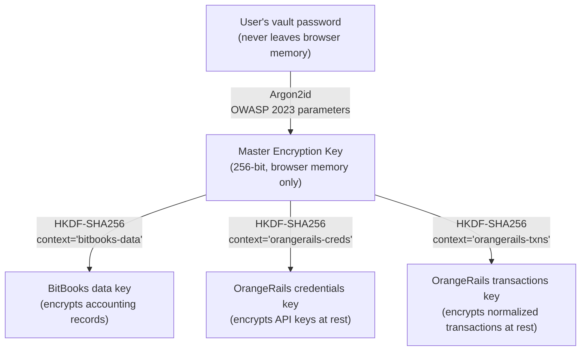
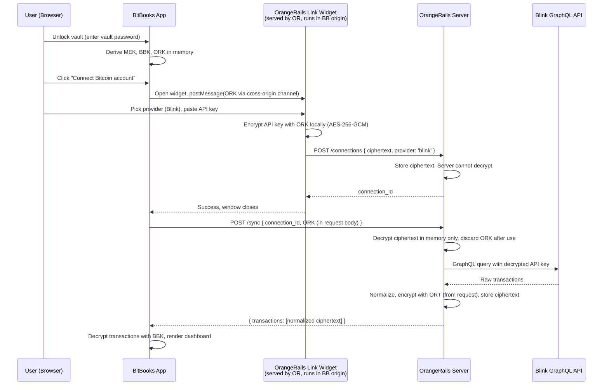

# OrangeRails Architecture

**Bitcoin Data Aggregation with Self-Custody for Your Data: The Definitive Technical and Strategic Reference**

**Version:** 1.1
**Last updated:** 2026-07-02
**Changed in 1.1:** product language moved from "zero-knowledge" to "self-custody for your data" / "client-sealed" (see the terminology note in Section 5); the term is retained only where it quotes or describes the wider industry. An earlier hosted convenience path that required transient server-side plaintext was decommissioned rather than shipped around.
**Status:** Source of truth, design all components against this document
**License:** The reference document itself is released under CC-BY-SA 4.0. Code implementations are Apache 2.0.

---

## Table of Contents

1. [Executive Summary](#1-executive-summary)
2. [The Problem](#2-the-problem)
3. [The Competitive Landscape](#3-the-competitive-landscape)
4. [Client Demand, Verbatim Voices](#4-client-demand--verbatim-voices)
5. [Session-Based Architecture: Self-Custody for Your Data](#5-session-based-architecture-self-custody-for-your-data)
6. [Why This Is Novel](#6-why-this-is-novel)
7. [Trust Model and Threat Analysis](#7-trust-model-and-threat-analysis)
8. [Regulatory and Legal Alignment](#8-regulatory-and-legal-alignment)
9. [Open Source as Verification](#9-open-source-as-verification)
10. [Cypherpunk Heritage](#10-cypherpunk-heritage)
11. [Non-Goals and Honest Limitations](#11-non-goals-and-honest-limitations)
12. [Frequently Asked Questions](#12-frequently-asked-questions)
13. [References](#13-references)

---

## 1. Executive Summary

OrangeRails is an open-source, session-based data aggregation service for Bitcoin-related accounts, built on one principle: self-custody for your data. It sits between end users and their Bitcoin service providers (wallets, exchanges, payment processors, mining pools, banks), aggregating transaction data and normalizing it into a single API shape that any application can consume.

**What makes OrangeRails structurally different from every existing data aggregator:**

- **Client-sealed credentials.** API keys for Blink, Kraken, BTCPay, etc. are encrypted in the user's browser with a key derived from their vault password. OrangeRails stores ciphertext only. The server cannot decrypt credentials on its own, decryption keys are passed in-transit during active user sessions and never persisted.

- **Bitcoin-first, Lightning-native.** Where competitors retrofit Bitcoin into multi-chain or multi-currency connectors, OrangeRails is architected around Bitcoin's transaction model, exchange-rate handling, and Lightning invoice lifecycle from the first line of code.

- **Open source (Apache 2.0).** Every line of the credential-handling path is publicly auditable. ZKA claims that cannot be independently verified are marketing fiction, our architecture reduces to code anyone can read.

- **Plaid's model is structurally unsound.** Plaid has not (yet) suffered a publicly disclosed breach, but it holds the largest consumer financial credential honeypot in existence. It is, in the words of a 2021 Hacker News commenter, "only one security breach away from being utterly destroyed." [[cite]](https://news.ycombinator.com/item?id=28229319) Every other aggregator we surveyed operates on the same model with the same structural risk.

**This document is the source of truth.** All subsequent design, data models, API contracts, UI flows, deployment topology, must trace back to the principles established here.

---

## 2. The Problem

### 2.1 What data aggregation looks like today

Data aggregation services, Plaid, Finicity, Mesh Connect, TrueLayer, Yodlee, MX, Teller, Vezgo, exist because financial institutions do not uniformly expose machine-readable APIs. Aggregators bridge that gap by either (a) accepting user credentials and logging in on the user's behalf ("screen-scraping"), or (b) negotiating OAuth-style integrations where providers support them.

In both models, the aggregator's servers **hold, or can hold, material sufficient to read the user's financial data at any time.** This is not an incidental architectural choice; it is necessary for the "background sync" experience users expect from modern fintech. If the server cannot access credentials when the user is offline, it cannot refresh balances overnight.

### 2.2 The structural risk

A credential aggregator is a single concentrated repository of millions of users' financial access. This makes aggregators the highest-value target class in consumer fintech. The risk is not that any individual aggregator is incompetent, it is that **the pattern itself does not fail gracefully.**

**Plaintiffs' counsel in Cottle v. Plaid Inc.** (3:20-cv-03056, N.D. Cal., settled 2021 for $58 million) put it explicitly:

> "Plaid's software is designed to spoof banks' websites so that consumers will feel more comfortable entering their login information, but consumers using fintech apps with Plaid's software are unwittingly handing their login information directly to Plaid." [[Herrera Kennedy LLP]](https://www.herrerakennedy.com/blog/consumer-banking-data-privacy-violations-lawsuit-filed-against-plaid-inc-on-behalf-of-users-of-venmo-and-other-fintech-applications)

The court filing continued:

> "Plaid executives have acknowledged this process was 'optimized' to increase 'user conversions', in other words, to provide a false sense of comfort to consumers by concealing Plaid's role as an unaffiliated third party." [[ClassAction.org]](https://www.classaction.org/news/class-action-fintech-middleman-plaid-uses-app-login-credentials-to-secretly-harvest-private-financial-data)

Plaid agreed to pay $58 million and to [minimize the data it stores going forward, delete certain previously retrieved data, and improve Plaid Link](https://www.plaidsettlement.com/frequently-asked-questions.php/). Notably, Plaid did not change the structural fact that it holds access to the login credentials of tens of millions of users.

### 2.3 What happens when an aggregator fails

On **March 7, 2025**, Krebs on Security reported:

> "On March 6, federal prosecutors in northern California said they seized approximately $24 million worth of cryptocurrencies that were clawed back following a $150 million cyberheist on Jan. 30, 2024." [[Krebs on Security]](https://krebsonsecurity.com/2025/03/feds-link-150m-cyberheist-to-2022-lastpass-hacks/)

The victim was Chris Larsen, co-founder of Ripple. The mechanism:

> "Victims all had at one point stored their cryptocurrency seed phrase, the secret code that lets anyone gain access to your cryptocurrency holdings, in the 'Secure Notes' area of their LastPass account prior to the 2022 breaches."

The LastPass breach is the load-bearing example for this document because it demonstrates two things at once:

1. **Zero-knowledge architecture saved LastPass users with strong master passwords.** Encrypted vault fields remained encrypted even after attackers exfiltrated the cloud backup on December 15, 2022. [[LastPass official statement]](https://blog.lastpass.com/posts/security-incident-update-recommended-actions) [[Wikipedia timeline]](https://en.wikipedia.org/wiki/LastPass_2022_data_breach)
2. **Users with weak master passwords were not saved.** Attackers brute-forced weak passwords for years afterward. TRM Labs reporting in December 2025 [[The Hacker News]](https://thehackernews.com/2025/12/lastpass-2022-breach-led-to-years-long.html) documented ongoing crypto theft traceable to the 2022 exfiltration.

The lesson is not "zero-knowledge doesn't work." The lesson is **zero-knowledge works, and the quality of user-derived keys matters immensely.** OrangeRails takes both halves of that lesson seriously.

### 2.4 The Yodlee precedent, when aggregators become unfaithful

LastPass was an attacker breach. Yodlee (Envestnet) is the opposite, a case where an aggregator was alleged to have deliberately monetized user data.

**Wesch v. Yodlee, Inc. et al.** (3:20-cv-05991, N.D. Cal.) alleges that Envestnet's data division distributed:

> "unencrypted plain text files that could be read by anyone who acquires them and contain highly sensitive information that make it possible to identify the individuals involved in each transaction." [[Complaint PDF]](https://www.classaction.org/media/wesch-v-yodlee-inc-et-al.pdf)

Senators Wyden and Brown, along with Rep. Anna Eshoo, demanded an FTC investigation in 2019. [[InvestmentNews]](https://www.investmentnews.com/fintech/lawmakers-demand-ftc-investigate-envestnet-yodlee-for-selling-consumer-financial-data/176551)

Users cannot verify aggregator claims without auditable code. "Trust us, we encrypt at rest" is not a security property, it is a promise, and promises can be broken.

### 2.5 The Zabo precedent, centralization risk is not hypothetical

In August 2021, Coinbase acquired Zabo, then the largest crypto data aggregator. [[Coindesk]](https://www.coindesk.com/business/2021/08/05/coinbase-agrees-to-buy-zabo-the-plaid-of-crypto-for-undisclosed-sum) The announcement included this line:

> "The existing Zabo API will be shut down within 14 days of closing the deal."

Every app built on Zabo had two weeks to rebuild. Users lost access. This is the centralization risk materialized for crypto aggregation: **a single closed-source aggregator can decide to deprecate the thing your product depends on, and you have no recourse.** Open-source alternatives exist precisely so that no single actor can unilaterally remove the infrastructure from under dependent applications.

---

## 3. The Competitive Landscape

### 3.1 Security architecture across all aggregators

| Aggregator | Credentials stored server-side? | Can the server decrypt on its own? | Claims zero-knowledge? | Primary source |
|---|:-:|:-:|:-:|---|
| **Plaid** | Yes (for screen-scraped banks) | Yes | No | [[Support]](https://support-my.plaid.com/hc/en-us/articles/4410324401047-Does-Plaid-have-access-to-my-credentials) [[Trust Center]](https://security.plaid.com/) |
| **Mesh Connect** | Tokens only | Yes (tokens) | No | [[Security]](https://www.meshpay.com/security) [[Docs]](https://docs.meshconnect.com/advanced/mesh-managed-tokens) |
| **Teller** | No (mTLS certificates) | Yes (via cert) | No | [[Docs]](https://teller.io/docs) [[Privacy]](https://teller.io/legal/user/privacy) |
| **TrueLayer** | Tokens only | Yes | No | [[Security]](https://truelayer.com/security/) |
| **Finicity / Mastercard** | Mixed (OAuth + creds) | Yes | No | [[Data Connect]](https://www.mastercard.com/us/en/business/open-finance/solutions/data/mastercard-data-connect.html) |
| **Vezgo** | Yes (for some exchanges) | Yes | No | [[FAQ]](https://vezgo.com/docs/faq/) |
| **MX Technologies** | Yes | Yes | No | [[Whitepaper]](https://www.mx.com/assets/resources/whitepapers/security-whitepaper.pdf) |
| **Yodlee** | Yes (HSM-wrapped) | Yes | No | [[Security FAQ]](https://developer.yodlee.com/resources/yodlee/faqs/docs/security) |
| **Zabo** | Defunct | N/A | N/A | [[Shutdown notice]](https://www.exirio.com/zabo-is-being-acquired-by-coinbase/) |
| **OrangeRails** | Ciphertext only | **No** | **Yes** | *(This document.)* |

**Zero** of nine surveyed major aggregators claim, or could claim, zero-knowledge. OrangeRails occupies an architecturally unoccupied position in the market.

### 3.2 The structural reason no one does this

Every ZKA product we can cite as a precedent, Bitwarden, 1Password, Proton, Tresorit, Tuta, Standard Notes, Signal, accepts the same fundamental tradeoff: **the server cannot perform operations that require decrypting user data when the user is offline.** Bitwarden's own documentation is explicit:

> "All Vault data remains encrypted when sent to the Bitwarden Cloud or a self-hosted server, and upon synchronizing data to other clients, it remains encrypted until the unique email address and master password are re-entered." [[Bitwarden Security White Paper]](https://bitwarden.com/help/bitwarden-security-white-paper/)

For password managers this tradeoff is invisible, users synchronize when they open the app, which is when they need a password anyway. For financial aggregators, the same tradeoff has historically been seen as unacceptable: "users expect background sync." OrangeRails challenges that assumption. Section 11 discusses why the tradeoff is acceptable in practice.

---

## 4. Client Demand, Verbatim Voices

This section documents demand for what OrangeRails is building, in users' own words.

### 4.1 Direct rejection of the Plaid model

Hacker News discussions have been consistent and vocal since at least 2016:

- *"Plaid is an evil nightmare product from Security Hell"* (2022 thread title). [[HN 30396156]](https://news.ycombinator.com/item?id=30396156)
- *"Ask HN: Are you terrified of Plaid's account verification approach?"* (September 2021). [[HN 28389576]](https://news.ycombinator.com/item?id=28389576)
- *"Plaid is only one security breach away from being utterly destroyed."* (August 2021). [[HN 28229319]](https://news.ycombinator.com/item?id=28229319)
- *"Ask HN: Do you use Plaid and give them your banking login info?"* (April 2021). [[HN 26797965]](https://news.ycombinator.com/item?id=26797965)
- *"I've never understood Plaid. Given what they do, they can't possibly encrypt the..."* (2023). [[HN 36210330]](https://news.ycombinator.com/item?id=36210330)
- *"Plaid does the opposite. It scrapes using your banks credentials."* (2022). [[HN 31563191]](https://news.ycombinator.com/item?id=31563191)

### 4.2 Open-source financial tool communities explicitly reject Plaid

**Firefly III**, the leading self-hosted personal finance manager, has an explicit community stance. From GitHub Discussion #7065:

> "There are no plans to integrate Plaid support directly into Firefly III... Plaid takes your username and password to your literal money and then does some opaque screen-scraping just to grab your transactions." [[Firefly III Discussion #7065]](https://github.com/orgs/firefly-iii/discussions/7065)

Firefly III's README reinforces this:

> "Firefly III is completely self-hosted and isolated, and will never contact external servers until you explicitly tell it to." [[Firefly III repo]](https://github.com/firefly-iii/firefly-iii)

**Actual Budget**, the rapidly growing open-source budgeting app, positions itself identically:

> "A super fast and privacy-focused app for managing your finances. You own your data." [[actualbudget.com]](https://actualbudget.com/)

A community member went so far as to build a third-party `actualplaid` bridge [[GitHub]](https://github.com/infiniteluke/actualplaid) rather than accept official Plaid integration.

**Maybe Finance** users filed [Issue #1764](https://github.com/maybe-finance/maybe/issues/1764) specifically demanding:

> "Bug: Self hosted apps should never attempt to reference Plaid provider unless keys provided."

Independent forks (e.g., [we-promise/sure](https://github.com/we-promise/sure/blob/main/docs/hosting/plaid.md)) have emerged to strip Plaid entirely.

**Beancount** users have built an entire ecosystem of tools to escape hosted aggregator lock-in: [plaid2beancount](https://github.com/reitblatt/plaid2beancount), [plaid2text](https://github.com/madhat2r/plaid2text), [lazy-beancount](https://github.com/Evernight/lazy-beancount) (privacy-focused docker packaging).

When Mint shut down in 2023, the top Hacker News response was [*"Is there a self-hosted alternative?"*](https://news.ycombinator.com/item?id=38700766). This is a community actively and vocally searching for what OrangeRails is building.

### 4.3 Bitcoin community voices on privacy

**Eric Hughes, A Cypherpunk's Manifesto (March 9, 1993)** [[activism.net]](https://www.activism.net/cypherpunk/manifesto.html):

> "Privacy is necessary for an open society in the electronic age. Privacy is not secrecy. A private matter is something one doesn't want the whole world to know, but a secret matter is something one doesn't want anybody to know. Privacy is the power to selectively reveal oneself to the world."

> "We cannot expect governments, corporations, or other large, faceless organizations to grant us privacy out of their beneficence... Privacy in an open society requires anonymous transaction systems."

> "Cypherpunks write code."

**Hal Finney, Cypherpunks mailing list, November 1992** [[Nakamoto Institute]](https://nakamotoinstitute.org/finney/):

> "Here we are faced with the problems of loss of privacy, creeping computerization, massive databases, more centralization, and [David] Chaum offers a completely different direction to go in, one which puts power into the hands of individuals rather than governments and corporations. The computer can be used as a tool to liberate and protect people, rather than to control them."

Finney wrote this thirty-four years ago. He described OrangeRails before OrangeRails existed.

**Phil Zimmermann, "Why I Wrote PGP" (1991, updated 1999)** [[philzimmermann.com]](https://philzimmermann.com/EN/essays/WhyIWrotePGP.html):

> "It's personal. It's private. And it's no one's business but yours."

> "PGP empowers people to take their privacy into their own hands. There's a growing social need for it. That's why I wrote it."

**Tim May, The Crypto Anarchist Manifesto (1988)** [[Nakamoto Institute]](https://nakamotoinstitute.org/library/crypto-anarchist-manifesto/):

> "Computer technology is on the verge of providing the ability for individuals and groups to communicate and interact with each other in a totally anonymous manner... These developments will alter completely the nature of government regulation, the ability to tax and control economic interactions, the ability to keep information secret, and will even alter the nature of trust and reputation."

**Satoshi Nakamoto, Bitcoin Whitepaper (October 31, 2008)** [[bitcoin.org]](https://bitcoin.org/bitcoin.pdf):

> "A purely peer-to-peer version of electronic cash would allow online payments to be sent directly from one party to another without going through a financial institution. Digital signatures provide part of the solution, but the main benefits are lost if a trusted third party is still required to prevent double-spending."

**Jameson Lopp** on self-custody (Yahoo Finance interview, 2024):

> "Humans tend to prioritize convenience over everything else, including privacy and security. So, yeah, we're fighting against human nature, which is never a good fight to be on." [[Yahoo Finance]](https://finance.yahoo.com/news/exclusive-jameson-lopp-says-bitcoin-180103383.html)

**Matt Odell**, summarized from repeated public appearances [[CoinDesk Layer 2]](https://www.coindesk.com/layer2/2022/03/09/people-will-get-burned-matt-odell-on-the-long-road-to-bitcoin-privacy):

> "Personal responsibility is something you must choose to practice yourself. If you don't care about your privacy and sovereignty, nobody else will."

**Jack Dorsey**, Bitkey self-custody wallet launch, April 2025 [[Daily Hodl]](https://dailyhodl.com/2025/04/24/billionaire-jack-dorsey-says-a-lot-coming-to-blocks-self-custody-bitcoin-wallet-next-month/):

> "We can provide the safety of collaborative custody, but without any visibility into your balance or transactions, a major unlock not just for bitcoiners but for all customers who we believe deserve the best privacy features."

**Erik Voorhees** on financial surveillance [[Decrypt]](https://decrypt.co/92129/shapeshift-erik-voorhees-cbdc-orwellian-spy-surveillance-nightmare):

> "It's like all the worst aspects of fiat today in your bank, plus Orwellian spy surveillance nightmare."

**Balaji Srinivasan**, February 2025 [[Bitcoinist]](https://bitcoinist.com/balaji-zcash-or-communism/):

> "No full list, if we encrypt it. No fixed location, either. They can't hit what they can't see."

These are not edge voices. They are the public intellectual thought leaders of the Bitcoin ecosystem and the demand-generating center of gravity for the product category OrangeRails addresses.

---

## 5. Session-Based Architecture: Self-Custody for Your Data

### 5.1 The core insight

The historical obstacle to self-custody financial aggregation has been **background sync.** Users expect aggregators to poll banks overnight so balances are fresh when they open their app in the morning. This requires the server to hold key material to decrypt credentials, which breaks the ciphertext-only guarantee.

OrangeRails' architectural choice: **accept that sync happens during active user sessions, not during offline background operations.** In exchange, we keep the strongest guarantee available on the most sensitive data in the system: the raw provider credentials exist server-side only as ciphertext sealed with user-derived keys.

**A note on terminology.** "Zero-knowledge" names two different things.
Zero-knowledge *proofs* (ZK-SNARKs and friends) are a cryptographic
protocol family; OrangeRails does not use them. Zero-knowledge
*architecture* is the password-manager sense of the word: the operator
stores only ciphertext it cannot decrypt, with keys derived from secrets
only the user holds. This document uses the term only in that second,
industry sense, and only when describing the wider category; our own
product language is "self-custody for your data" and "client-sealed",
precisely to avoid the ambiguity.

**And a note on what we removed.** An earlier hosted convenience path
required the server to handle plaintext transiently. It was decommissioned
in mid-2026 rather than shipped around: when convenience and the
ciphertext-only guarantee conflict, the guarantee wins. The paths that
remain are the client-sealed ones described here, plus Stealth Sync for
on-chain wallet data (see docs/Stealth-Sync.md), where matching and
sealing run entirely in the user's browser.

This mirrors the design choice made by every successful zero-knowledge product (Bitwarden, 1Password, Proton, Signal, Tresorit, Tuta, Standard Notes). None of them support server-initiated operations on offline user data. OrangeRails is the first data aggregator to make the same architectural commitment.

### 5.2 Key hierarchy

**Design principles:**

1. **Only the vault password ever derives keys.** The password is never stored, never transmitted, never logged.
2. **Each domain has its own subkey.** Compromise of one subkey does not compromise others. This is the standard HKDF key-separation pattern used in Signal, Noise, and TLS 1.3.
3. **All subkeys are ephemeral.** They exist only in the user's browser memory during an active session. When the vault locks (inactivity timeout or explicit lock), they are zeroed.

### 5.3 Connection flow, user adds a Blink account

**What the OrangeRails server permanently stores after this flow:**

- `connection_id` (opaque UUID)
- `provider_type` ('blink')
- `encrypted_credentials` (AES-256-GCM ciphertext, undecryptable without ORK)
- `created_at`: `last_sync_at` (timestamps, plaintext for scheduling)

**What it does NOT store:**

- The raw Blink API key (only ciphertext)
- The user's email, name, phone number, IP address, or any personally identifying information
- ORK or any other key material
- Any association between the connection and the user's "real" identity

### 5.4 Sync flow, how transactions arrive

Sync is triggered exclusively by an authenticated request from a connected app (e.g., BitBooks), carrying the user's ORK in-transit. The server cannot initiate a sync on its own.

1. User opens BitBooks in the morning. Vault unlocks. MEK, BBK, ORK derived.
2. BitBooks calls `POST /sync` on OrangeRails with `{ connection_ids: [...], ORK }` in the TLS-encrypted request body.
3. OrangeRails server loads the user's encrypted credentials from storage.
4. In memory only, it decrypts the credentials using the ORK passed in the request.
5. It calls Blink's GraphQL API with the decrypted credentials, fetches new transactions since the last cursor.
6. It normalizes the transactions into OrangeRails' canonical transaction shape.
7. It encrypts the normalized transactions with the user's ORT (also passed in the request).
8. It stores the encrypted normalized transactions and returns them to BitBooks.
9. It discards ORK and ORT from memory immediately.

**Key properties:**

- Duration of plaintext credential existence on the server: the lifespan of a single HTTP request (milliseconds to seconds).
- Duration of ORK existence on the server: the same.
- Logs never contain ORK, the decrypted API key, or the plaintext transaction data. Logging is limited to: request timestamps, connection_ids, byte counts, upstream API HTTP status codes, duration metrics.

### 5.5 What the server never sees

| Data class | Where it exists in plaintext | Server exposure |
|---|---|---|
| Vault password | User's brain, keyboard, browser memory | Never |
| MEK, BBK, ORK, ORT | Browser memory only | Never at rest; ORK/ORT in-transit and memory-only during sync |
| Blink API key (plaintext) | User's dashboard.blink.sv, browser memory during entry | Memory-only during sync; never at rest |
| Normalized transaction descriptions | Browser after decrypt | Memory-only during sync; never at rest |
| User email / name / PII | BitBooks (opt-in) | **None.** OrangeRails identifies users by opaque UUID |
| User IP address | Edge routers | Stripped before application logs |

### 5.6 What the server does see

- Ciphertext blobs (credentials and normalized transactions, both encrypted with user-derived keys).
- Opaque connection_ids and user_ids (UUIDs with no external meaning).
- Upstream provider identity ("this connection targets Blink").
- Sync timestamps and durations.
- HTTP-level metadata required for the request (TLS headers, etc.).

This is the minimum information sufficient to route a sync request to the correct provider. Nothing more.

---

## 6. Why This Is Novel

### 6.1 No financial aggregator does this

Section 3.1 documents the security architectures of every major aggregator. Not one claims or could claim zero-knowledge encryption of credentials. The closest anyone comes is Yodlee's claim of HSM-wrapped credentials [[Yodlee Security FAQ]](https://developer.yodlee.com/resources/yodlee/faqs/docs/security), which was undercut by the 2020 class action alleging distribution of unencrypted plaintext files [[Wesch v. Yodlee complaint]](https://www.classaction.org/media/wesch-v-yodlee-inc-et-al.pdf).

### 6.2 The precedent exists, in other categories

Our architecture is not novel in the absolute sense. It is a direct application of patterns proven in other zero-knowledge products:

**Bitwarden Security White Paper** [[bitwarden.com]](https://bitwarden.com/help/bitwarden-security-white-paper/):
> "Bitwarden does not know your Master Password."
> "All vault data stored in Bitwarden is end-to-end encrypted and not accessible by anyone except the Bitwarden user."

**1Password Security Design** [[agilebits.github.io]](https://agilebits.github.io/security-design/):
Two-Secret Key Derivation (2SKD) combines account password + 128-bit client-side Secret Key. Authentication uses Secure Remote Password (SRP) protocol, credentials are never transmitted even at login.

**Proton** [[proton.me]](https://proton.me/security/end-to-end-encryption):
> "With Proton Mail's zero-access encryption, Proton literally cannot decrypt your messages even if it wanted to."

**Tresorit** [[tresorit.com]](https://tresorit.com/features/zero-knowledge-encryption):
> "Tresorit's servers never receive your encryption keys, which means the company has zero technical ability to read your data, even under legal compulsion."

**Standard Notes** [[standardnotes.com]](https://standardnotes.com/help/security/encryption):
> "It treats the server as a dumb data-store."

**Tuta** [[tuta.com]](https://tuta.com/encryption):
> "Tuta uses a zero-knowledge architecture, which means that the user's data is never stored in plain text on Tuta's servers."

**Signal** [[signal.org]](https://signal.org/docs/):
> "Signal cannot decrypt or otherwise access the content of your messages or calls."

### 6.3 The novel contribution

OrangeRails is the first application of this architectural pattern to **financial data aggregation specifically.** We are not inventing zero-knowledge encryption; we are importing a proven pattern into a category that has, until now, defaulted to trust-the-aggregator models.

---

## 7. Trust Model and Threat Analysis

### 7.1 Normal operation

Users trust:
- Their own browser (for key derivation and local decryption).
- TLS endpoints (for in-transit protection of ORK/ORT during sync).
- The open-source OrangeRails codebase (verifiable).
- The chosen providers themselves (Blink, Kraken, etc.), to the degree they hold data independent of OrangeRails.

Users do **not** need to trust:
- OrangeRails server operators (they cannot decrypt user data at rest).
- OrangeRails hosting provider.
- OrangeRails database administrators.
- Any downstream actor with access to the OrangeRails database.

### 7.2 Server breach scenarios

**Scenario A, Attacker exfiltrates the OrangeRails database.**

What attacker gets:
- Ciphertext of every user's encrypted credentials.
- Ciphertext of every user's encrypted normalized transactions.
- Opaque UUIDs. Timestamps.

What attacker must do to decrypt:
- Brute-force each user's individual vault password against AES-256-GCM ciphertext using Argon2id KDF with memory-hard parameters.
- Argon2id with recommended parameters (m=65536 KiB, t=3, p=4) makes offline brute force economically infeasible for any password above ~14 characters of realistic entropy.

**Scenario B, Attacker compromises the OrangeRails running application.**

What attacker gets:
- Real-time access to plaintext credentials and transaction data, **but only for users currently syncing.**
- Each sync holds keys in memory for milliseconds to seconds.
- No long-term key material is resident in server memory.

What attacker cannot do:
- Retroactively decrypt historical data.
- Decrypt data for offline users.
- Establish persistent surveillance of a specific user without hooking every sync request in real-time and immediately being detected.

**Scenario C, Attacker compromises a user's browser session (malware, XSS).**

What attacker gets:
- Full access to that user's MEK, BBK, ORK, ORT.
- Full plaintext of that user's data.

This is identical to the risk for Bitwarden, 1Password, Proton, and every ZKA product in existence. **The only defense is client-side hygiene** (browser isolation, device security, no browser extensions on sensitive tabs). OrangeRails does not claim to protect against compromise of the user's own endpoint.

### 7.3 Comparison: same attack, Plaid vs. OrangeRails

| Attack | Plaid outcome | OrangeRails outcome |
|---|---|---|
| DB exfiltration | Attacker gets screen-scraped credentials + tokens, can access all linked accounts in plaintext. | Attacker gets ciphertext, must brute-force each individual user's password. |
| Application compromise | Attacker establishes persistent surveillance of all users' transaction streams. | Attacker sees only active sync requests in real-time; detection probability is much higher. |
| Malicious insider | DBA can read any user's financial history. | DBA reads ciphertext only. |
| Subpoena / legal compulsion | Plaid can be ordered to produce decrypted data. | OrangeRails can be ordered to produce ciphertext, producing plaintext is infeasible without the user's password. |

### 7.4 The Tresorit legal argument, applicable to OrangeRails

Tresorit's GDPR compliance page makes a structural legal argument worth importing:

> "Because of Tresorit's end-to-end encryption, it is infeasible to decrypt the files and in turn, the personal data in them. Thus, server-side hacks are not considered data breaches, and the GDPR's data breach notifications requirements do not apply." [[Tresorit GDPR]](https://tresorit.com/gdpr)

Under GDPR Article 34, breach notification is required only when the breach is likely to result in a high risk to affected individuals. Ciphertext exfiltration, under a true ZKA model, is arguably not such a breach. OrangeRails should seek legal review to confirm this framing applies, and should publish the resulting legal opinion once obtained.

---

## 8. Regulatory and Legal Alignment

### 8.1 GDPR, Article 5(1)(c), data minimization

> "Personal data shall be... adequate, relevant and limited to what is necessary in relation to the purposes for which they are processed ('data minimisation');" [[Article 5]](https://gdpr-info.eu/art-5-gdpr/)

OrangeRails stores the minimum data required to operate: opaque UUIDs, ciphertext, timestamps, provider type. No email, no name, no IP at application layer, no transaction plaintext. This is arguably the most data-minimal architecture possible for a functioning aggregator.

### 8.2 GDPR, Article 25, privacy by design

> "Taking into account the state of the art... the controller shall... implement appropriate technical and organisational measures, such as pseudonymisation, which are designed to implement data-protection principles, such as data minimisation, in an effective manner and to integrate the necessary safeguards into the processing." [[Article 25]](https://gdpr-info.eu/art-25-gdpr/)

Zero-knowledge encryption is the state-of-the-art implementation of privacy by design. The principle is not just followed but architecturally encoded: **we cannot violate it even if we wanted to.**

### 8.3 GDPR, Article 32, security of processing

> "the pseudonymisation and encryption of personal data" [[Article 32]](https://gdpr-info.eu/art-32-gdpr/)

Direct textual mandate. OrangeRails is the encryption.

### 8.4 PSD2, Strong Customer Authentication

EU Delegated Regulation 2018/389 [[EBA]](https://www.eba.europa.eu/publications-and-media/press-releases/eba-clarifies-application-strong-customer-authentication) mandates that payment service providers ensure:

> "only the payment service user is associated, in a secure manner, with the personalised security credentials, the authentication devices and the software."

Screen-scraping aggregators that collect credentials are increasingly disfavored under PSD2, which prefers OAuth-style flows. OrangeRails' architecture exceeds even the OAuth model by ensuring that even OrangeRails itself cannot unilaterally use the credentials, they require the user's active session.

### 8.5 NYDFS 23 NYCRR Part 500.15

> "Each Covered Entity shall implement controls, including encryption, to protect Nonpublic Information held or transmitted by the Covered Entity." [[NYDFS Part 500]](https://www.dfs.ny.gov/system/files/documents/2023/03/23NYCRR500_0.pdf)

The 2023 amendment [[Paul Hastings analysis]](https://www.paulhastings.com/insights/client-alerts/nydfs-releases-major-update-to-part-500-cybersecurity-requirements) tightened encryption-at-rest requirements effective November 1, 2025. OrangeRails exceeds the requirement, we cannot decrypt even with our own keys.

### 8.6 CCPA / CPRA, Sensitive Personal Information

California's CPRA [[CPRA text]](https://www.caprivacy.org/cpra-text/) classifies as Sensitive Personal Information:

> "consumer's account log-in, financial account, debit card, or credit card number in combination with any required security or access code, password, or credentials allowing access to an account."

Under §1798.121, consumers may direct businesses to "only use" SPI for limited purposes. Because OrangeRails cannot read the SPI in its possession, compliance with limitation requests is trivial, there is nothing to limit.

### 8.7 Disclaimer

This section is informational, not legal advice. Before publication, OrangeRails should engage competent counsel in each of its intended operating jurisdictions and publish the resulting formal legal analysis.

---

## 9. Open Source as Verification

Zero-knowledge claims are unverifiable without auditable code. A closed-source vendor saying "trust us, we encrypt everything" provides no stronger guarantee than a handshake.

**OrangeRails is Apache 2.0 licensed.** This is the de facto standard for Bitcoin open-source infrastructure [[Galoy]](https://github.com/GaloyMoney), [[BTCPay Server]](https://github.com/btcpayserver), [[Lightning Development Kit]](https://github.com/lightningdevkit), [[LND]](https://github.com/lightningnetwork/lnd), all Apache 2.0.

**What "open source" means in practice for an OrangeRails user:**

1. **Audit the credential encryption path.** Start at `src/widgets/link/credential-encrypt.ts`. Verify that encryption happens client-side and ciphertext is all that leaves the browser.
2. **Audit the sync path.** Start at `apps/server/src/sync/handler.ts`. Verify that decryption happens only in-memory during request handling, that keys are zeroed after use, and that no key material is logged.
3. **Run your own instance.** The same code runs in our hosted service and in your self-hosted Docker deployment. Same guarantees, zero trust required.
4. **Reproduce builds.** We publish build provenance via SLSA-compliant supply chain attestation so you can verify the production binary matches the public source.

The Tresorit legal argument depends on end-to-end encryption being actually implemented, not just claimed. **Only open source makes that verifiable.**

---

## 10. Cypherpunk Heritage

Bitcoin itself was built on the foundation of two decades of cypherpunk thought. OrangeRails continues that tradition explicitly.

**Satoshi Nakamoto**, Bitcoin whitepaper abstract, 2008 [[bitcoin.org]](https://bitcoin.org/bitcoin.pdf):

> "A purely peer-to-peer version of electronic cash would allow online payments to be sent directly from one party to another without going through a financial institution."

**Eric Hughes**, A Cypherpunk's Manifesto, 1993 [[activism.net]](https://www.activism.net/cypherpunk/manifesto.html):

> "Privacy is necessary for an open society in the electronic age... Privacy is the power to selectively reveal oneself to the world."

> "Cypherpunks write code. We know that someone has to write software to defend privacy, and since we can't get privacy unless we all do, we're going to write it."

**Tim May**, The Crypto Anarchist Manifesto, 1988 [[Nakamoto Institute]](https://nakamotoinstitute.org/library/crypto-anarchist-manifesto/):

> "Computer technology is on the verge of providing the ability for individuals and groups to communicate and interact with each other in a totally anonymous manner."

**Phil Zimmermann**, Why I Wrote PGP, 1991 [[philzimmermann.com]](https://philzimmermann.com/EN/essays/WhyIWrotePGP.html):

> "It's personal. It's private. And it's no one's business but yours."

**Hal Finney**, cypherpunks mailing list, November 1992 [[Nakamoto Institute]](https://nakamotoinstitute.org/finney/):

> "Here we are faced with the problems of loss of privacy, creeping computerization, massive databases, more centralization, and Chaum offers a completely different direction to go in, one which puts power into the hands of individuals rather than governments and corporations. The computer can be used as a tool to liberate and protect people, rather than to control them."

Finney's 1992 indictment of "creeping computerization, massive databases, more centralization" is an accurate description of the contemporary financial aggregator landscape thirty-four years later. OrangeRails exists to answer it.

---

## 11. Non-Goals and Honest Limitations

We believe the fastest way to lose trust is to overclaim. This section documents what OrangeRails does **not** promise.

### 11.1 We do not offer background sync while the user is offline

Every other ZKA product accepts this same tradeoff. Bitwarden does not sync your passwords in the middle of the night; Proton does not fetch email for an offline user; Signal only queues encrypted messages until you come online. OrangeRails is the same.

**Practical impact:** If Sarah opens BitBooks Monday morning, the sync happens in seconds and she sees fresh data. If she doesn't open BitBooks for a week, the sync runs when she does. This matches the natural rhythm of accounting software usage, which is not a real-time alerting use case.

**For users who require real-time alerts** (e.g., "notify me when >1 BTC enters my hot wallet"), a future opt-in mode may permit reduced-privacy alerting with a server-held alert key, explicitly disclosed at enrollment. This is a future roadmap item, not a V1 guarantee.

### 11.2 Metadata is partially visible

The server sees:
- Which providers you have connected (e.g., "this user has a Blink connection and a Kraken connection").
- When syncs happen and how much data they return (byte counts).
- Upstream HTTP status codes.

We do not attempt to hide this metadata. Hiding provider identity would require mix-network-style padding and dummy traffic, which is out of scope for V1. Users with extreme metadata-privacy requirements should run self-hosted.

### 11.3 We cannot protect a compromised client

If your laptop is infected with a keylogger, your vault password is exposed the moment you type it. OrangeRails provides no defense against this, nor does Bitwarden, 1Password, Proton, or Signal. Client endpoint security is the user's responsibility.

### 11.4 We are not a custody product

OrangeRails does not hold Bitcoin. It holds read-only access tokens that let it fetch your transaction history from custodians you have already chosen to trust (Blink, Kraken, etc.). Your funds are never at risk from an OrangeRails breach because we never have the ability to move them.

### 11.5 We are not an anonymity product

OrangeRails prevents us from reading your financial data. It does not anonymize you to Blink, to the Bitcoin blockchain, or to tax authorities. Those concerns require different tools (CoinJoin, Tor, etc.). We are complementary to, not a substitute for, those tools.

### 11.6 Weak passwords weaken the system

If your vault password is "bitcoin123", the LastPass lesson applies, ciphertext exfiltration becomes a practical risk. OrangeRails will:

- Enforce minimum 12-character passwords (OWASP 2023).
- Use Argon2id memory-hard KDF at recommended parameters.
- Require a password strength check (zxcvbn or equivalent) rejecting common patterns.
- Offer (future) hardware-key-backed vault auth (WebAuthn, YubiKey) for users who want it.

Strong keys are a shared responsibility. We architect against a brute force as aggressively as we can, users must bring their half of the bargain with a strong password.

---

## 12. Frequently Asked Questions

**Q: If OrangeRails can't read my data, how does it sync?**

Your browser decrypts the credentials in the moment of sync and passes the decryption key to our server over TLS for the duration of that single request. The server uses the key in memory to decrypt your credentials, fetches data from the provider, re-encrypts the result, and discards the key. We never store the key.

**Q: What if I lose my vault password?**

Your data is permanently unrecoverable. This is the cost of self-custody for your data: we cannot reset a password we never had. Write down your password, store it in a physical safe, or use a separate password manager. In the future we will offer optional escrow recovery via hardware keys, but password loss under the default configuration means data loss.

**Q: Why should I trust your implementation?**

You shouldn't, you should audit it. The entire codebase is public (Apache 2.0). Build provenance is attested. Reproducible builds mean you can verify the running binary matches the published source.

**Q: How does this compare to Plaid?**

Plaid holds your bank credentials in a form they can decrypt. If Plaid is breached, attackers get immediate access to your linked accounts. OrangeRails cannot decrypt your credentials without your active participation, a breach gives attackers ciphertext only.

**Q: Does this work with all Bitcoin providers?**

V1 supports Blink, Kraken, BTCPay, and xpub-based watch-only wallets. Additional adapters (LND, Core Lightning, Sparrow, Mesh, Coinbase, Strike, Fedi, Braiins Pool, Ocean Pool, Swan, River, ViaBTC) are on the roadmap. The adapter SDK is public, the community can add providers.

**Q: What happens if OrangeRails shuts down?**

Your data lives in your BitBooks (or other connected app) database, encrypted with your own keys. Self-hosting is supported on day one via Docker Compose. You are not dependent on OrangeRails-the-hosted-service continuing to exist.

**Q: Is the hosted service required?**

No. The entire OrangeRails stack runs on a single Linux machine with Docker Compose. Self-hosting provides the strongest privacy guarantees, not even ciphertext leaves your network.

**Q: Why not just use Plaid?**

See Section 2.

---

## 13. References

### Primary sources, architecture and security documentation

- Plaid Trust Center, https://security.plaid.com/
- Plaid Core Exchange security documentation, https://plaid.com/core-exchange/docs/security/
- Mesh Connect security page, https://www.meshpay.com/security
- Mesh Connect managed tokens, https://docs.meshconnect.com/advanced/mesh-managed-tokens
- Teller documentation, https://teller.io/docs
- TrueLayer security page, https://truelayer.com/security/
- TrueLayer security policy, https://truelayer.com/security/security-policy/
- Finicity / Mastercard Data Connect, https://www.mastercard.com/us/en/business/open-finance/solutions/data/mastercard-data-connect.html
- Vezgo FAQ, https://vezgo.com/docs/faq/
- MX Technologies security whitepaper, https://www.mx.com/assets/resources/whitepapers/security-whitepaper.pdf
- Yodlee developer security FAQ, https://developer.yodlee.com/resources/yodlee/faqs/docs/security

### Primary sources, ZKA precedent products

- Bitwarden Security White Paper, https://bitwarden.com/help/bitwarden-security-white-paper/
- Bitwarden KDF algorithms, https://bitwarden.com/help/kdf-algorithms/
- 1Password Security Design Whitepaper, https://agilebits.github.io/security-design/
- Proton end-to-end encryption, https://proton.me/security/end-to-end-encryption
- Proton Mail encryption explained, https://proton.me/support/proton-mail-encryption-explained
- Standard Notes encryption, https://standardnotes.com/help/security/encryption
- Signal documentation, https://signal.org/docs/
- Signal Double Ratchet specification, https://signal.org/docs/specifications/doubleratchet/
- Signal formal security analysis (IACR 2016/1013), https://eprint.iacr.org/2016/1013.pdf
- Tresorit zero-knowledge page, https://tresorit.com/features/zero-knowledge-encryption
- Tresorit GDPR page, https://tresorit.com/gdpr
- Tuta encryption page, https://tuta.com/encryption

### Primary sources, legal and regulatory

- EU GDPR full text (EUR-Lex), https://eur-lex.europa.eu/legal-content/EN/TXT/HTML/?uri=CELEX:32016R0679
- GDPR Article 5, https://gdpr-info.eu/art-5-gdpr/
- GDPR Article 25, https://gdpr-info.eu/art-25-gdpr/
- GDPR Article 32, https://gdpr-info.eu/art-32-gdpr/
- PSD2 Strong Customer Authentication (Wikipedia), https://en.wikipedia.org/wiki/Strong_customer_authentication
- EBA on SCA, https://www.eba.europa.eu/publications-and-media/press-releases/eba-clarifies-application-strong-customer-authentication
- NYDFS 23 NYCRR Part 500 (full text PDF), https://www.dfs.ny.gov/system/files/documents/2023/03/23NYCRR500_0.pdf
- NYDFS 2023 amendment, https://www.dfs.ny.gov/system/files/documents/2023/12/rf23_nycrr_part_500_amend02_20231101.pdf
- CPRA text, https://www.caprivacy.org/cpra-text/
- California AG CCPA page, https://oag.ca.gov/privacy/ccpa

### Primary sources, breach history

- LastPass 2022 breach (Wikipedia), https://en.wikipedia.org/wiki/LastPass_2022_data_breach
- LastPass official incident disclosure, https://blog.lastpass.com/posts/notice-of-recent-security-incident
- LastPass March 2023 update, https://blog.lastpass.com/posts/security-incident-update-recommended-actions
- Krebs on Security, $150M cyberheist linked to LastPass (March 2025), https://krebsonsecurity.com/2025/03/feds-link-150m-cyberheist-to-2022-lastpass-hacks/
- The Hacker News, LastPass crypto theft through 2025, https://thehackernews.com/2025/12/lastpass-2022-breach-led-to-years-long.html
- Cottle v. Plaid complaint, https://www.classaction.org/media/cottle-et-al-v-plaid-inc.pdf
- Plaid settlement site, https://www.plaidsettlement.com/
- Plaid settlement FAQ, https://www.plaidsettlement.com/frequently-asked-questions.php/
- Wesch v. Yodlee complaint, https://www.classaction.org/media/wesch-v-yodlee-inc-et-al.pdf
- Equifax 2017 breach (Wikipedia), https://en.wikipedia.org/wiki/2017_Equifax_data_breach
- FTC Equifax settlement, https://www.ftc.gov/enforcement/refunds/equifax-data-breach-settlement

### Primary sources, cypherpunk foundations

- Bitcoin whitepaper, https://bitcoin.org/bitcoin.pdf
- Eric Hughes, A Cypherpunk's Manifesto, https://www.activism.net/cypherpunk/manifesto.html
- Tim May, The Crypto Anarchist Manifesto, https://nakamotoinstitute.org/library/crypto-anarchist-manifesto/
- Phil Zimmermann, Why I Wrote PGP, https://philzimmermann.com/EN/essays/WhyIWrotePGP.html
- Hal Finney archive, https://nakamotoinstitute.org/finney/

### Community and user demand

- Hacker News "Plaid is an evil nightmare", https://news.ycombinator.com/item?id=30396156
- Hacker News "Only one security breach away", https://news.ycombinator.com/item?id=28229319
- Firefly III Plaid discussion, https://github.com/orgs/firefly-iii/discussions/7065
- Actual Budget Plaid issue, https://github.com/actualbudget/actual/issues/898
- Maybe Finance Plaid issue, https://github.com/maybe-finance/maybe/issues/1764
- Herrera Kennedy LLP Plaid analysis, https://www.herrerakennedy.com/blog/consumer-banking-data-privacy-violations-lawsuit-filed-against-plaid-inc-on-behalf-of-users-of-venmo-and-other-fintech-applications
- ClassAction.org Plaid coverage, https://www.classaction.org/news/class-action-fintech-middleman-plaid-uses-app-login-credentials-to-secretly-harvest-private-financial-data

### Bitcoin community voices

- Jameson Lopp articles, https://www.lopp.net/articles.html
- Matt Odell CoinDesk profile, https://www.coindesk.com/layer2/2022/03/09/people-will-get-burned-matt-odell-on-the-long-road-to-bitcoin-privacy
- Jack Dorsey Bitkey launch, https://dailyhodl.com/2025/04/24/billionaire-jack-dorsey-says-a-lot-coming-to-blocks-self-custody-bitcoin-wallet-next-month/
- Erik Voorhees on CBDCs, https://decrypt.co/92129/shapeshift-erik-voorhees-cbdc-orwellian-spy-surveillance-nightmare
- Balaji Srinivasan "Zcash or communism", https://bitcoinist.com/balaji-zcash-or-communism/
- Lyn Alden interview, https://medium.com/@elenasegatini/the-power-of-showing-up-an-interview-with-lyn-alden-on-bitcoin-and-the-next-generation-ec5d63b68601
- Zabo shutdown (Coindesk), https://www.coindesk.com/business/2021/08/05/coinbase-agrees-to-buy-zabo-the-plaid-of-crypto-for-undisclosed-sum

---

**End of OrangeRails Architecture v1.0.**

*Every component, data models, API surfaces, UI flows, deployment topology, MUST be designed against this document. When conflicts arise during implementation, the text of this document is authoritative until formally amended.*

*Amendments require (a) written proposal, (b) discussion period, (c) explicit update of this file with changelog entry and version bump.*
