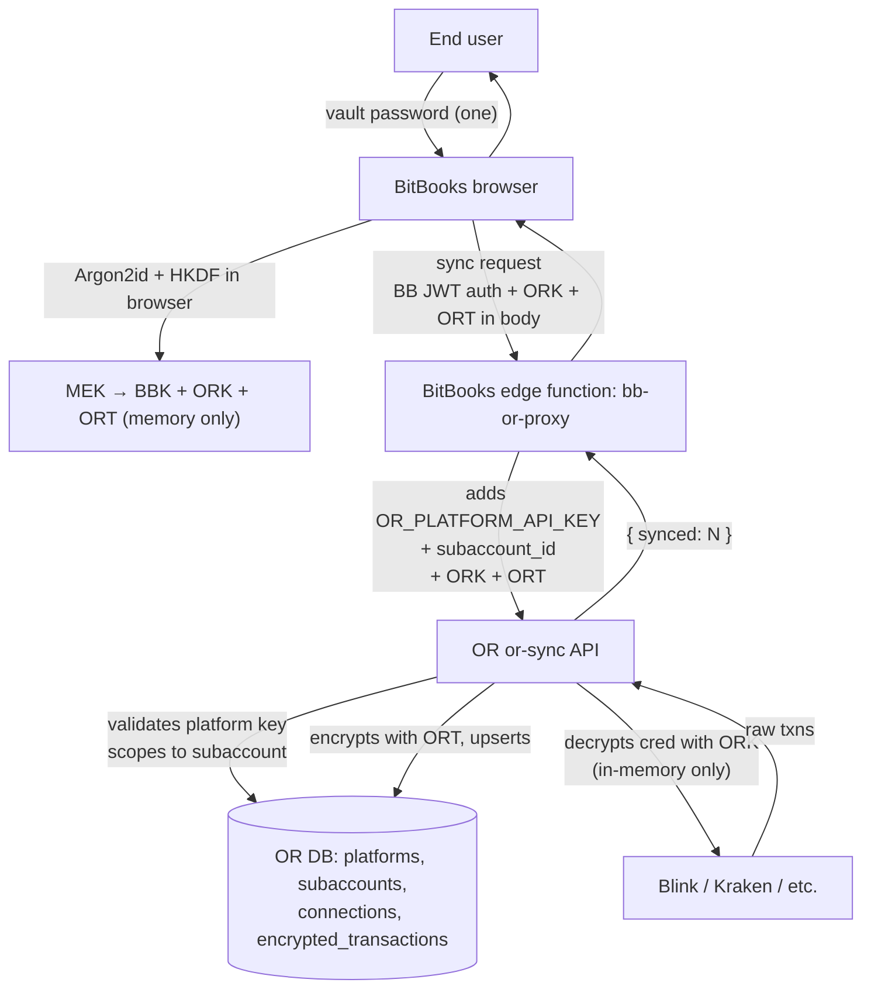

# OrangeRails Platform Design — Plaid for Bitcoin

**Status**: Approved 2026-04-21 (session 2026-04-21-BIRCH). Supersedes the cross-app token approach in `OrangeRails-CoAdmins.md` for end-user flows.
**Version**: 1.0
**Audience**: developers building OrangeRails, platform integrators (BitBooks V3, BitBooks Personal, future apps)

---

## 1. Problem statement

OrangeRails serves three distinct audiences (per `/pricing`):

1. **Individuals** (Self-Host / Personal / Prosumer) — manage their own Bitcoin connections directly
2. **Teams & Businesses** (Team / Business / Enterprise) — same as Individuals plus SSO/audit
3. **Developers** (Sandbox / Production / Enterprise API) — embed OR in their own product, billed per connection like Plaid

The first two log into `orangerails.com/app` and use OR like a SaaS. The third group's *end users* should never see OR — they live in the integrating product (BitBooks V3, BitBooks Personal, etc.) and use one vault password for everything.

The original architecture (one shared `auth.users` table, X-OR-Access-Token for cross-app calls) worked for proof-of-concept but doesn't scale to the multi-tenant Plaid model the pricing page promises.

This document defines the platform-tenant model that unifies all three audiences.

---

## 2. Mental model

| Concept | Description |
|---|---|
| **Platform** | A consumer of the OR API. Holds a long-lived API key. BitBooks V3 is a platform. BitBooks Personal is a platform. Self-hosted instances of OR can register their own platforms. There is one built-in platform called `direct` representing OR's own consumer mode. |
| **Subaccount** | An end user as far as OR is concerned. Belongs to exactly one platform. Identified by a UUID that means nothing to OR — just an opaque key for grouping connections and transactions. No PII, no email, no auth credentials. |
| **Connection** | A user's link to a Bitcoin provider (Blink, Kraken, etc.). Owned by a subaccount. Encrypted credentials, encrypted label, sync state. |
| **Encrypted transaction** | A normalized transaction from a provider, stored encrypted with the subaccount's transactions key. |

**Crucial**: subaccounts have no auth. The platform vouches for them via the platform API key. ZKA is preserved because the subaccount's encryption keys are derived in the user's browser from their platform vault password — never stored anywhere on OR.

---

## 3. Architecture diagram



Key points:
- The end user authenticates only with BitBooks. OR has no concept of the user's email or identity.
- BitBooks holds `OR_PLATFORM_API_KEY` as a Supabase secret. It never reaches the browser.
- The browser sends ORK + ORT through BitBooks to OR. ZKA is preserved because keys exist on the OR server only for the duration of one HTTP request.
- OR's database stores everything keyed by `subaccount_id` — a UUID that means nothing to OR but maps to "end user X of platform Y" inside BitBooks.

---

## 4. Database schema

```sql
-- Platforms that consume OR. BitBooks V3 = one row. BitBooks Personal = one row.
-- 'direct' is a built-in platform representing OR's own /app consumer mode.
CREATE TABLE platforms (
  id              UUID PRIMARY KEY DEFAULT gen_random_uuid(),
  slug            TEXT UNIQUE NOT NULL,
  name            TEXT NOT NULL,
  api_key_hash    TEXT UNIQUE NOT NULL,        -- SHA-256 hex of the raw API key
  -- Pricing tier the platform is on (Sandbox / Production / Enterprise)
  tier            TEXT NOT NULL DEFAULT 'sandbox',
  is_internal     BOOLEAN NOT NULL DEFAULT false,  -- true for 'direct' platform
  created_at      TIMESTAMPTZ NOT NULL DEFAULT now()
);

INSERT INTO platforms (slug, name, api_key_hash, tier, is_internal)
VALUES ('direct', 'OrangeRails Direct', '<hash-of-internal-shared-secret>', 'production', true);

-- Subaccounts: end users as OR sees them.
-- For 'direct' platform: external_user_id = the auth.users.id of the OR user.
-- For other platforms: external_user_id = whatever ID the platform uses internally.
CREATE TABLE subaccounts (
  id                 UUID PRIMARY KEY DEFAULT gen_random_uuid(),
  platform_id        UUID NOT NULL REFERENCES platforms(id) ON DELETE CASCADE,
  external_user_id   TEXT NOT NULL,
  created_at         TIMESTAMPTZ NOT NULL DEFAULT now(),
  UNIQUE (platform_id, external_user_id)
);

CREATE INDEX idx_subaccounts_external ON subaccounts(platform_id, external_user_id);

-- Connections: replace user_id with subaccount_id.
ALTER TABLE connections
  DROP COLUMN user_id,
  ADD COLUMN subaccount_id UUID NOT NULL REFERENCES subaccounts(id) ON DELETE CASCADE;

CREATE INDEX idx_connections_subaccount ON connections(subaccount_id);
```

What's removed:
- `user_vault_meta` is no longer required for platform-managed users (the platform owns auth). It stays for `direct` platform users (legacy `/app` consumer login).
- `apps`, `user_app_grants`, `create_or_access_token` RPCs all retire — platforms use API keys instead of per-user tokens.

What's preserved:
- `auth.users` for `/app` direct sign-in
- `user_vault_meta` for `direct` platform subaccounts
- `connections`, `encrypted_transactions` (just re-keyed to subaccount_id)
- All ZKA crypto (`vault.ts`, `key-derivation.ts`)

---

## 5. API surface

All endpoints require `Authorization: Bearer <platform_api_key>`. RLS is bypassed via service role; the edge function enforces platform isolation by hashing the bearer token and resolving to a `platform_id`, then filtering all DB ops by that platform's subaccounts.

### `POST /functions/v1/or-provision`
Create or look up a subaccount for an end user.
```
Request: { external_user_id: string }
Response: { subaccount_id: uuid }
```
Idempotent. If a subaccount already exists for `(platform_id, external_user_id)`, returns the existing one.

### `POST /functions/v1/or-connection-create`
Store an encrypted connection for a subaccount. The platform's browser already encrypted the credential with the user's ORK before calling.
```
Request: {
  subaccount_id: uuid,
  provider_type: 'blink' | 'kraken' | ...,
  encrypted_label: string,        // base64 AES-256-GCM ciphertext
  encrypted_credentials: string   // base64 AES-256-GCM ciphertext
}
Response: { connection_id: uuid }
```

### `POST /functions/v1/or-connection-list`
List all connections for a subaccount (encrypted blobs returned as-is — the platform's browser decrypts).
```
Request: { subaccount_id: uuid }
Response: { connections: [{ id, provider_type, encrypted_label, encrypted_credentials, status, last_sync_at, encrypted_last_error }] }
```

### `POST /functions/v1/or-connection-delete`
```
Request: { subaccount_id: uuid, connection_id: uuid }
Response: { ok: true }
```

### `POST /functions/v1/or-sync` (refactor of existing)
Sync one or more connections. Browser passes ORK + ORT in-transit.
```
Request: {
  subaccount_id: uuid,
  connection_ids?: uuid[],
  credentials_key: string,    // base64 ORK — in-transit only
  transactions_key: string    // base64 ORT — in-transit only
}
Response: { synced: number, connections: [{ connection_id, synced, error? }] }
```

### `POST /functions/v1/or-transactions-list`
List recent encrypted transactions for a subaccount (browser decrypts with ORT).
```
Request: { subaccount_id: uuid, limit?: number, before?: timestamptz }
Response: { transactions: [{ id, connection_id, encrypted_payload, occurred_at }] }
```

---

## 6. The platform integration pattern

For BitBooks V3 (representative — same pattern for BitBooks Personal and any future platform):

1. **One-time platform setup**: create a platform record on OR. Generate a long random API key. Store the SHA-256 hash in `platforms.api_key_hash`. Give BitBooks the raw key, which it stores as a Supabase secret named `OR_PLATFORM_API_KEY`.

2. **One-time per end user**: when a BitBooks user first navigates to Connections, BitBooks calls `or-provision` with their BitBooks `auth.users.id` as `external_user_id`. OR returns a `subaccount_id`. BitBooks stores it on the user record.

3. **Vault unlock**: when the user unlocks their BitBooks vault, the existing Argon2id derivation produces the BitBooks MEK. Two new HKDF derivations produce ORK and ORT, both held in the existing `keyRef` state alongside the accounting key.

4. **Add a connection**: user picks Blink, pastes API key. Browser encrypts with ORK. BitBooks edge function adds the platform key + subaccount ID, calls `or-connection-create`. OR stores the encrypted blob.

5. **Sync**: user clicks Sync. Browser exports ORK + ORT as base64 from `keyRef`. BitBooks edge function adds platform key + subaccount ID, calls `or-sync`. OR decrypts cred with ORK in memory, calls Blink, encrypts results with ORT, returns a count. No password prompt — the vault is already unlocked.

6. **List / display**: BitBooks calls `or-connection-list` and `or-transactions-list`. Browser decrypts with ORK / ORT for display. Same browser memory keys, never persisted.

---

## 7. The `/app` consumer mode

`orangerails.com/app` continues to work for direct OR users (Individual / Team / Business pricing tiers).

- These users sign in via Supabase Auth (`auth.users`)
- On first sign-in, OR auto-provisions a subaccount under the `direct` platform with `external_user_id = auth.uid()`
- The existing `/app` UI (connections list, sync, vault, co-admin, etc.) keeps working — it just internally references the user's `direct` subaccount instead of `auth.uid()` directly
- The Add-Connection / Sync / Delete flows reuse the same edge functions as platform integrators (with the `direct` platform key)

A new "Developers" tab is added to `/app` for users who want to register their own platform:
- Create platform → see the API key once → copy and store
- Rotate API key (invalidates the previous hash)
- View subaccount count + sync volume
- See per-tier billing summary

This is groundwork for Production-tier billing later. v1 just needs the management surface.

---

## 8. Migration of existing data

Current OR has the maintainer's user account with one Blink connection.

1. Run the migration script to create `platforms` and `subaccounts` tables
2. Insert the `direct` platform row (with a hash of an internally-known secret)
3. For every existing row in `connections` where `user_id IS NOT NULL`:
   - INSERT into `subaccounts` with `platform_id = direct` and `external_user_id = user_id::text` (idempotent on conflict)
   - UPDATE the connection to point at the new subaccount
4. Drop the `user_id` column on `connections`

the maintainer's Blink connection survives. He sees the same UI on `orangerails.com/app`. He also receives a generated `bitbooks-v3` platform API key that gets installed in V3's Supabase as a secret.

---

## 9. Build order (5 steps)

1. **OR DB migration** (estimate 1 hour): `platforms` + `subaccounts` tables. Migrate existing `connections.user_id` to direct subaccounts. Insert built-in `direct` platform. Generate `bitbooks-v3` platform with API key returned to a secrets file (the maintainer installs it as a Supabase secret in V3).
2. **OR API refactor** (estimate 1.5 hours): new edge functions `or-provision`, `or-connection-create`, `or-connection-list`, `or-connection-delete`, `or-transactions-list`. Refactor `or-sync` to scope by `subaccount_id` and validate platform API key via SHA-256 hash lookup.
3. **OR `/app` minor refactor** (estimate 1 hour): existing pages keep working, just look up the user's `direct` subaccount to find their connections. Add a stub Developers tab.
4. **V3 changes** (estimate 1.5 hours): derive ORK + ORT in `VaultContext` at unlock; rewrite `Connections.tsx` to be native (no token paste form, no password modal); add `bb-or-proxy` edge function holding `OR_PLATFORM_API_KEY` secret; auto-provision subaccount on first Connections visit.
5. **End-to-end test** (estimate 30 minutes): the maintainer re-adds Blink in V3 once. Click Sync. Verify count and on-page display.

Total: 4–6 hours of focused work.

---

## 10. What this preserves vs. changes

**Preserved:**
- ZKA crypto contract (Argon2id + HKDF + AES-256-GCM, all in browser memory)
- The `or-sync` engine (decrypt creds in-memory, call provider, encrypt results, discard keys)
- The `/app` consumer experience for Individual / Team / Business pricing tiers
- All adapter code (Blink GraphQL query, normalization, etc.)

**Changed:**
- `connections` and `encrypted_transactions` are now scoped by `subaccount_id` instead of `auth.uid()`
- Cross-app auth uses platform API keys, not per-user `user_app_grants` tokens
- BitBooks end users have one password (theirs), one prompt (vault unlock), no OR account
- The X-OR-Access-Token + Argon2id-with-OR-salt re-derivation in V3 goes away — V3 derives ORK directly from its own MEK using HKDF

**Removed (deprecated):**
- `apps` table (replaced by `platforms`)
- `user_app_grants` table (replaced by platform API keys)
- `create_or_access_token`, `revoke_or_access_token`, `list_or_access_tokens` RPCs
- The "API Tokens" section in `/app` (replaced by the new Developers tab for platform management)

---

## 11. Pricing alignment

Direct quote from `/pricing` Developer tier intro:
> *"Building a product that needs Bitcoin data ingestion? These tiers are usage-based, like Plaid. Benchmark: Plaid charges $0.30–$1.00 per connection per month + per-API-call fees. We match the shape — but Bitcoin-first, open-source, and zero-knowledge."*

And the caption under the Developer cards:
> *"BitBooks itself is our first developer-API customer. Clean intra-company pricing — our own product pays us per connected user."*

This document is the engineering implementation of those promises. The Production tier (`$500/mo base + $0.50/connection/month + $0.001/API call`) is metered by counting subaccounts and API calls per platform. The Sandbox tier rate-limits and caps at 5 test connections per platform. The Enterprise API tier removes the cap and adds a custom contract.

The Individual / Team / Business tiers continue to be served by the `/app` UI under the `direct` platform.

---

**End of OrangeRails Platform Design v1.0.**
